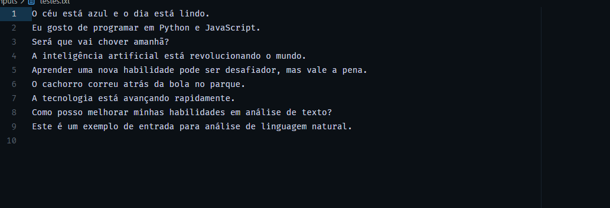

# Projeto de Análise de Texto 📄  

## Descrição  
Este projeto analisa sentenças usando IA e documenta os aprendizados.  

## Estrutura  
- `inputs/sentences.txt`: Contém sentenças para análise.  
- `README.md`: Explica o projeto e mostra insights.  

## Insights Obtidos  
- Aprendi a importância de estruturar arquivos corretamente.  
- Percebi como organizar um repositório pode ajudar na colaboração.  

## Prints do Processo  

